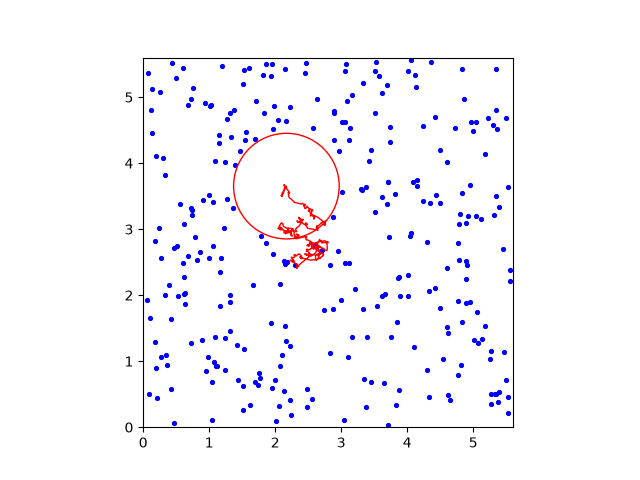
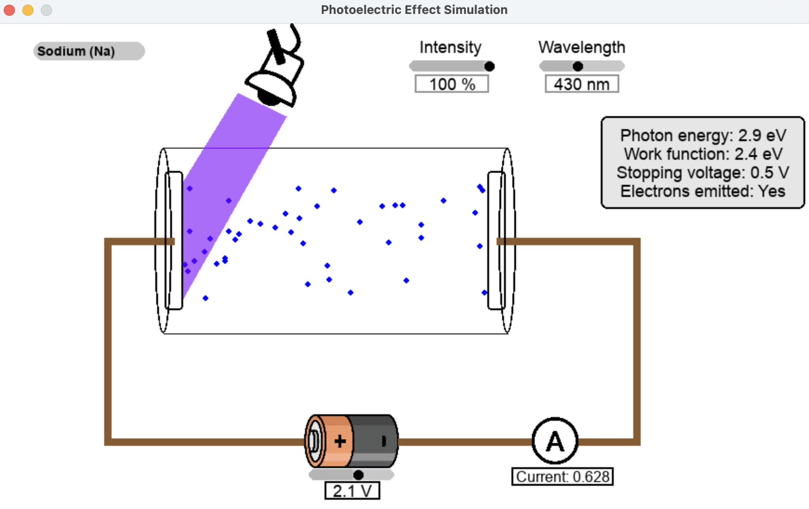
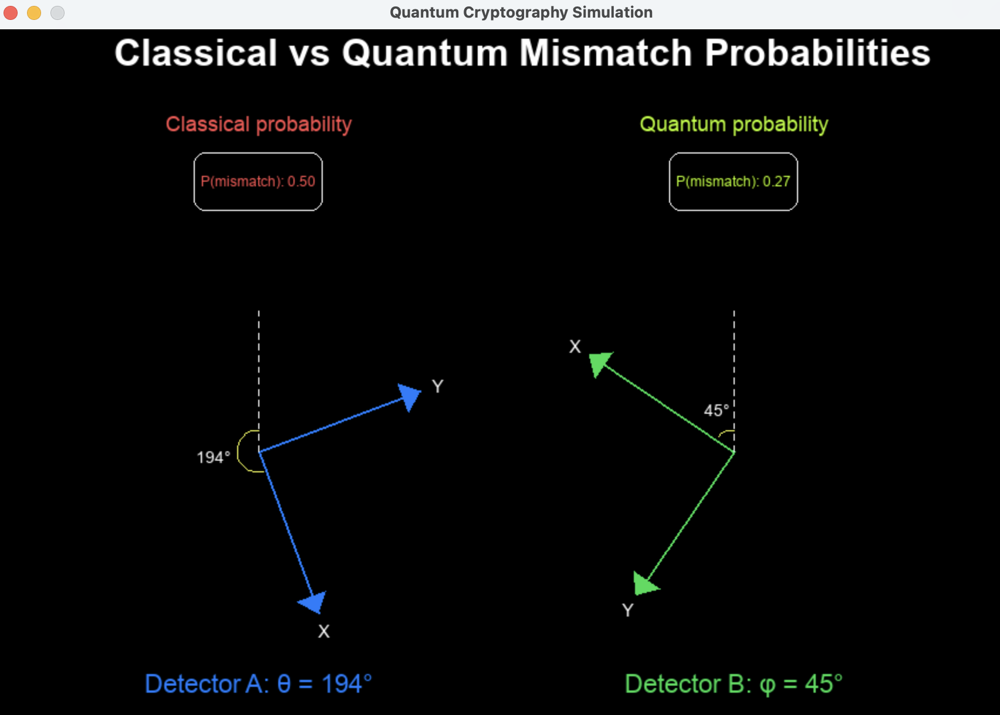
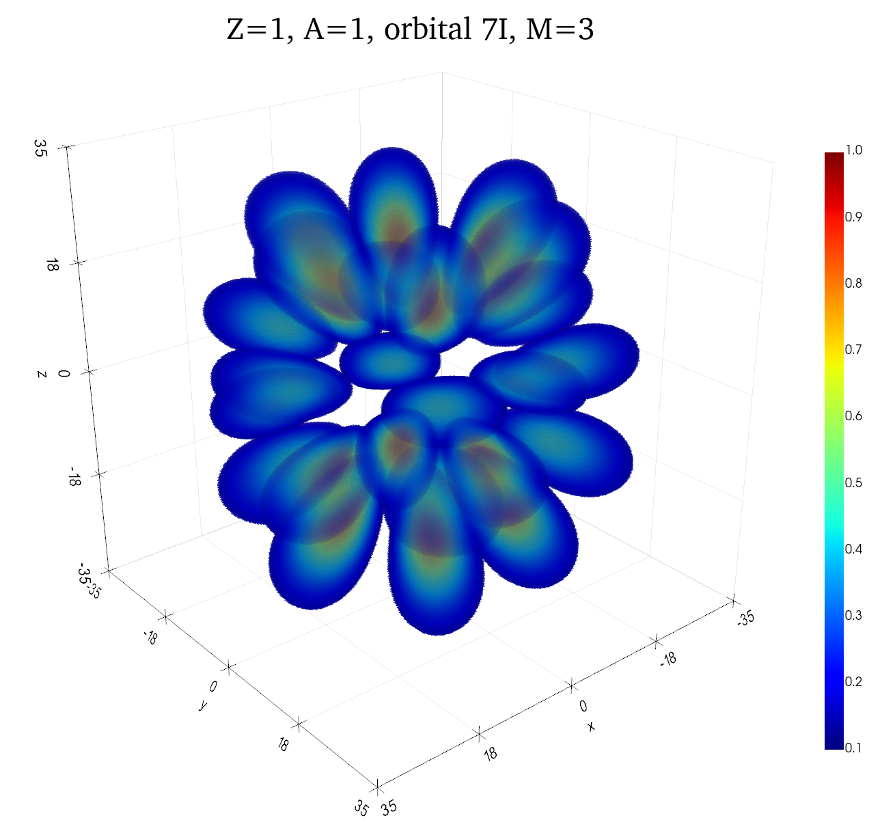

# BPhO Computational Physics Challenge 2026
My submission to the British Physics Olympiad Computational Physics Challenge involving modelling quantum mechanics using Python. Also includes a problem sheet in LaTeX.

## Submission Video: 
https://www.youtube.com/watch?v=Boz_FdN7sq8

## Overview
- Rendered 3D hydrogenic orbitals using PyVista and animated transitions between m numbers
- Created interactive simulations using Pygame (photoelectric effect, quantum cryptography)
- Developed interactive GUIs (random walks)
- Investigated numerical methods for integrating the Planck Spectrum (including Adaptive Simpson's rule)
- 3000 lines of Python code

## Tasks:

### Task 1 - Random Walks

- Developed an interactive simulation of 2D random walks using Tkinter and Matplotlib, allowing users to change step size, step number, and number of walks
- Animated 3D random walks using PyVista

### Task 2 - Brownian Motion
- Animation of 2D Brownian Motion using Matplotlib, simulating the interaction of one larger particle with many smaller particles

### Task 3 - Black Body Radiation and Numerical Methods
- Plotted Einstein's model of molar heat capacity
- Developed an interactive application to plot the Planck Black Body Radiation spectrum at inputted temperatures
- Extension: investigated numerical methods used to integrate the Planck Spectrum, including the trapezium rule both static and adaptive Simpson's rule. Verified the Stefan-Boltzmann law and developed animations of methods

### Task 4 - Photoelectric Effect
- Created a GUI plotting stopping voltage against frequency, allowing users to choose a metal from a dropdown menu
- Extension: developed an interactive photoelectric effect simulation using Pygame, allowing users to change metal, intensity, wavelength and voltage

### Task 5 - Photon Emissions
- Plotted photon energy against wavelength for photon emissions from hydrogen atoms

### Task 6 - Electron Diffraction
- Created a computer model of electron diffraction rings, plotted the ring radii against accelerating voltage and confirmed the atomic spacing d

### Task 7 - Particle in a Box
- Plotted energy against quantum number n and probability densities against displacement for the particle in a box model
- Extension: completed the Quantum Mechanics problem sheet and wrote up my solutions using LaTeX, which involved proving a solution to the Schrödinger equation, and showing that the particle satisfies the uncertainty principle

### Task 8 - Quantum Cryptography
- Developed an interactive simulation of quantum cryptography using Pygame, allowing users to adjust the angles of detectors, with classical and quantum mismatch probabilities displayed

### Task 9 - Compton Scattering
- Plotted fractional wavelength shift, electron recoil speed and electron recoil angle against photon scattering angle

### Task 10 - Hydrogenic Orbitals
- Plotted hydrogenic orbitals using PyVista with 2D slices and 3D visualisations
- Extension: animated the morphing of orbitals at fixed n and l quantum numbers between different values of m

---

## Requirements:
Python 3.12, PyVista, NumPy, Matplotlib, Tkinter, colour, SciPy, Pygame, Pygame Widgets

<b>Requirements:</b> Python 3.12 · NumPy · SciPy · Matplotlib · PyVista · Tkinter · Pygame · pygame-widgets · colour
